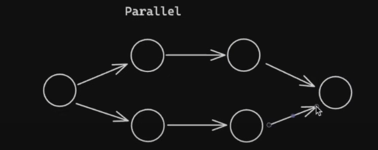
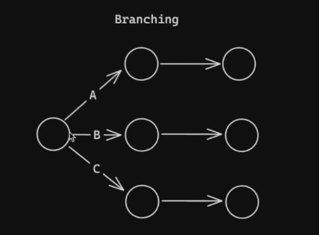

# What is a Chain?

- We are chaining different tasks and we are passing the output of one task into the input of the next task.
- We can use LangChain Expression Language (LCEL)

# LCEL (High Level)

- Example of LCEL: chain = prompt | model
- Explanation: chain = task1 | task2 | task3
- To run the chain: chain.invoke({"key": "value"})

# Extras

- Normal chain

- You can even run tasks in parallel

- You can do branching as well. For example, based on a result of a task, we can perform different set of chains.

- What's cool with runnable RunnableLambda is you can use it to do something like make an API call. Look at 3_chains_extended.py to see how to incorporate RunnableLambdas with chain.
