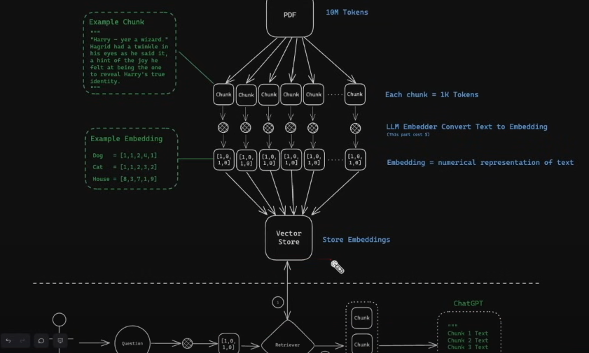
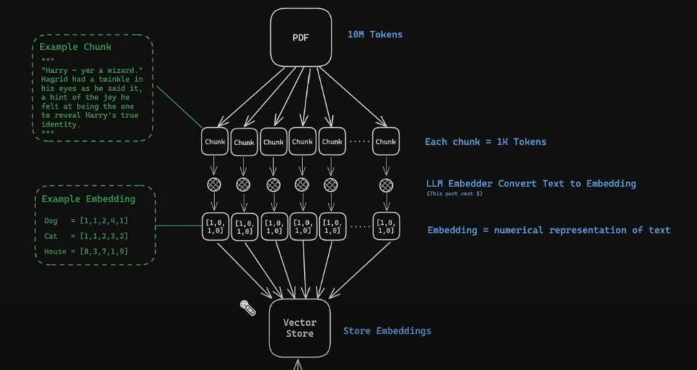
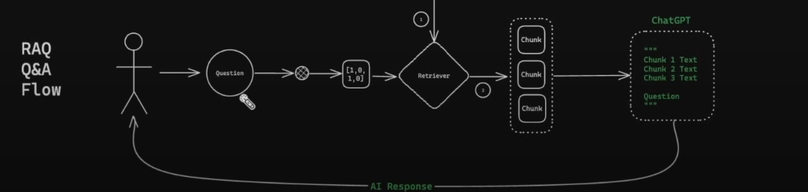

# What is RAG? (Intro)

- Under the hood, we are giving the LLMs additional information so that they can answer our questions.
- We can feed the LLMs websites, PDFs, Code and Video Transcripts.

# How RAG works (High Level)

- Example Image
  

  - Top of image
    

    - Let's say we pass in a PDF and it has 10 million tokens and it's way to big for us to analyse it or answer any questions. OpenAI has a window of about only 8k tokens.
    - What we need to do is to split the PDF up into a bunch of smaller chunks that are about 1k tokens each.
    - Next, we convert each chunk of text into embeddings so that we can easily compare them and contrast them.
    - After we have embedded all the chunks of text, we start saving the embeddings and the original text/ chunk into a vector store. This is important because what we want to do is we want to be able to ask questions and be able to retrieve related documents from the vector store.

  - Bottom of image
    
    - At the start, let's say we ask a question "Which professor is a also a werewolf in Harry Potter?".
    - That question will be embedded itself so that we can look up similar documents to our question. That embedding will have a numerical representation of "professor" and "werewolf"
    - Whenever we use our retriever to look up similar embeddings in the vector store, it will go like "oh chapter 4 paragraph 1, 2 and 3 all talk about this professor that is a werewolf. Let me give you back those chunks of data/ blob or text so that you can ask questions about them."
    - Once we have those chunk returned, what we can do is pass them over to ChatGPT. All we are doing for the prompt is adding those pieces/ chunks of text at the very beginning of our prompt and then at the very bottom we will have our question.

# Metadata

- Sometimes, LLMs can "hallucinate", meaning that they can get stuff wrong.
- What's cool is whenever we add in metadata to our RAG query, what we are basically doing is allowing our LLMs to respond with "here is the source of information for where I am generating this information I am passing back to you". This means we can go to the source to double check whether the LLMs response is accurate/ correct.
